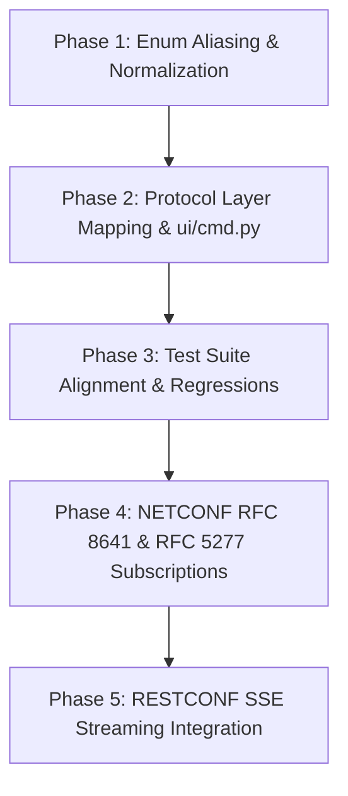

# Protocol-Neutral Delivery Policy & Multi-Protocol Telemetry Specification

**Target Component:** `config/delivery.py`, `specs/gnmi_client.py`, `specs/netconf_client.py`, `ui/cmd.py`  
**Document Status:** Approved Design / Specification for Future Implementation  
**Related Documents:** [`docs/fully_support_subscribe_services.md`](./fully_support_subscribe_services.md), [`.agents/rules/RULES.md`](../.agents/rules/RULES.md)  
**Workspace Location:** [`docs/protocol_neutral_delivery_mode_spec.md`](./protocol_neutral_delivery_mode_spec.md)

---

## 1. Executive Summary & Problem Statement

In the early architecture of `gnmi_client_py`, telemetry streaming options directly mirrored gNMI protocol buffer enums (`SAMPLE`, `ON_CHANGE`, `ONCE`, `POLL`, `TARGET_DEFINED`). While functional for pure gNMI targets, this tight coupling creates semantic friction and architectural leakage as the engine expands into multi-protocol Northbound operations (NETCONF RFC 5277 / RFC 8639 / RFC 8641, and RESTCONF RFC 8040 / RFC 8650).

### Key Architectural Objectives
1. **Decouple Delivery Semantics from Wire Protocols**:
   Establish a protocol-agnostic [`DeliveryMode`](../config/delivery.py#L4) enum rooted in IETF standards (RFC 8641 YANG-Push) and distributed telemetry patterns.
2. **Unified Protocol Translation Layer**:
   Each protocol client implementation (`GNMIClient`, `NetconfClient`, `RestconfClient`) becomes responsible for mapping neutral delivery policies into wire-specific frames, headers, and RPC stubs.
3. **Replace all legacy notations**:
   Replace all enum values previously defined in `DeliveryMode` as described here. But do not modify user interfaces — CLI and YAML.  

---

## 2. Protocol-Neutral Terminology Specification

### 2.1 The `DeliveryMode` Enumeration

The finalized enum definition establishes grammatical and semantic consistency across all telemetry modes:

```python
class DeliveryMode(str, Enum):
    # Core Protocol-Neutral Members
    PERIODIC = "periodic"                  # Time-interval sampling (RFC 8641 / gNMI SAMPLE)
    EVENT_DRIVEN = "event_driven"          # State mutations & notifications (RFC 8641 / RFC 5277 / gNMI ON_CHANGE)
    SNAPSHOT = "snapshot"                  # One-time state capture (gNMI ONCE / NETCONF unary get)
    ON_DEMAND = "on_demand"                # Explicit client/user-triggered polling (gNMI POLL)
    SERVER_DETERMINED = "server_determined" # Server/Target selects optimal mode based on schema

```

### 2.2 Detailed Semantics & Rationale

| Member Name | String Value | Grammar / Part of Speech | Rationale & Standards Alignment |
| :--- | :--- | :--- | :--- |
| `PERIODIC` | `"periodic"` | Adjective | Direct alignment with **IETF RFC 8641** (`<periodic>` push). Updates are triggered solely by the passage of configured time intervals (`interval`). |
| `EVENT_DRIVEN` | `"event_driven"` | Compound Participle | Encompasses both datastore value changes (YANG-Push `<on-change>` / gNMI `ON_CHANGE`) and discrete event streams (RFC 5277 / RFC 8639 notifications). |
| `SNAPSHOT` | `"snapshot"` | Noun-adjunct | Decouples from gNMI's wire-specific `ONCE`. Conveys that the client requests the current matching state, synchronizes, and cleanly terminates the stream. |
| `ON_DEMAND` | `"on_demand"` | Adjective | Decouples from gNMI's `POLL`. Polling is often invoked programmatically by automated workflows or schedulers without an interactive human console. |
| `SERVER_DETERMINED` | `"server_determined"` | Compound Participle | Replaces gNMI's `TARGET_DEFINED`. In NETCONF/RESTCONF (RFC 6241 / RFC 8040), the network element is designated as the "Server". |

---

## 3. Protocol Translation & Mapping Matrix

The engine enforces strict worker agnosticism: managers and configuration models pass [`DeliveryPolicy`](../config/delivery.py#L12) to the protocol client. The client implementation performs the protocol translation.

### 3.1 Mapping Reference Table

| Neutral `DeliveryMode` | gNMI Specification (`specs/gnmi_client.py`) | NETCONF YANG-Push (`RFC 8641 / RFC 8639`) | NETCONF Event Stream (`RFC 5277`) | RESTCONF (`RFC 8040 / RFC 8650`) |
| :--- | :--- | :--- | :--- | :--- |
| **`PERIODIC`** | `SubscriptionList.Mode.STREAM`<br>`SubscriptionMode.SAMPLE`<br>`sample_interval = policy.interval * 10^9` | `<establish-subscription>`<br>`<periodic>`<br>`<period>policy.interval * 100</period>` | *Unsupported* (RFC 5277 is purely event-driven) | `POST /restconf/operations/establish-subscription`<br>`{"periodic": {"period": ...}}` |
| **`EVENT_DRIVEN`** | `SubscriptionList.Mode.STREAM`<br>`SubscriptionMode.ON_CHANGE`<br>`heartbeat_interval = policy.heartbeat * 10^9` | `<establish-subscription>`<br>`<on-change>`<br>`<dampening-period>...</dampening-period>` | `<create-subscription>`<br>`<stream>NETCONF</stream>` | Server-Sent Events (SSE)<br>`GET /restconf/data/...` with `Accept: text/event-stream` |
| **`SNAPSHOT`** | `SubscriptionList.Mode.ONCE`<br>(Closes after `sync_response`) | Unary `<get>` or `<get-config>` with subtree/XPath filter | *N/A* (Unary RPC) | Unary HTTP `GET` request |
| **`ON_DEMAND`** | `SubscriptionList.Mode.POLL`<br>(Emits `SubscribeRequest(poll=Poll())` on demand) | Polled client `<get>` loop over persistent SSH session | *N/A* | Polled HTTP `GET` loop over persistent HTTP/2 session |
| **`SERVER_DETERMINED`**| `SubscriptionList.Mode.STREAM`<br>`SubscriptionMode.TARGET_DEFINED` | Target capability default push | *N/A* | Server default stream |

### 3.2 Target Protocol Implementations

#### gNMI Translation Example (`specs/gnmi_client.py`)
```python
MODE_TO_GNMI_LIST_MODE = {
    DeliveryMode.PERIODIC: gnmi_pb2.SubscriptionList.STREAM,
    DeliveryMode.EVENT_DRIVEN: gnmi_pb2.SubscriptionList.STREAM,
    DeliveryMode.SERVER_DETERMINED: gnmi_pb2.SubscriptionList.STREAM,
    DeliveryMode.SNAPSHOT: gnmi_pb2.SubscriptionList.ONCE,
    DeliveryMode.ON_DEMAND: gnmi_pb2.SubscriptionList.POLL,
}
```

#### NETCONF RFC 8641 Translation Example (`specs/netconf_client.py`)
```python
def _build_yang_push_rpc(self, policy: DeliveryPolicy, path: str) -> str:
    if policy.mode == DeliveryMode.PERIODIC:
        period_centiseconds = policy.interval * 100
        return f"""
        <establish-subscription xmlns="urn:ietf:params:xml:ns:yang:ietf-subscribed-notifications"
                                xmlns:yp="urn:ietf:params:xml:ns:yang:ietf-yang-push">
            <yp:xpath-filter>{path}</yp:xpath-filter>
            <yp:periodic>
                <yp:period>{period_centiseconds}</yp:period>
            </yp:periodic>
        </establish-subscription>
        """
    elif policy.mode == DeliveryMode.EVENT_DRIVEN:
        return f"""
        <establish-subscription xmlns="urn:ietf:params:xml:ns:yang:ietf-subscribed-notifications"
                                xmlns:yp="urn:ietf:params:xml:ns:yang:ietf-yang-push">
            <yp:xpath-filter>{path}</yp:xpath-filter>
            <yp:on-change>
                <yp:dampening-period>0</yp:dampening-period>
            </yp:on-change>
        </establish-subscription>
        """
    ...
```

---

## 4. Normalization and Configuration Parsing

### 4.1 Input Normalization in `DeliveryPolicy`
Users may provide delivery modes via YAML configurations or CLI flags using different casing or delimiters (`event-driven` vs `event_driven` vs `EVENT_DRIVEN`). 

[`DeliveryPolicy`](../config/delivery.py#4) provides automatic normalization:

```python
@dataclass(frozen=True, kw_only=True)
class DeliveryPolicy:
    mode: DeliveryMode = DeliveryMode.PERIODIC
    interval: int = 0         # Sample interval in seconds
    heartbeat: int = 0        # Heartbeat interval in seconds
    suppress_redundant: bool = False

    @classmethod
    def from_raw(cls, mode: Union[str, DeliveryMode], **kwargs) -> "DeliveryPolicy":
        """Factory method accepting string or enum with delimiter normalization."""
        if isinstance(mode, str):
            norm = mode.strip().lower().replace("_", "-")
            # Map legacy gNMI strings
            legacy_map = {
                "sample": DeliveryMode.PERIODIC,
                "on-change": DeliveryMode.EVENT_DRIVEN,
                "once": DeliveryMode.SNAPSHOT,
                "poll": DeliveryMode.ON_DEMAND,
                "target-defined": DeliveryMode.SERVER_DETERMINED,
            }
            resolved_mode = legacy_map.get(norm, DeliveryMode(norm))
        else:
            resolved_mode = mode
        return cls(mode=resolved_mode, **kwargs)

    def validate(self) -> None:
        if self.interval < 0:
            raise ValueError(f"interval must be >= 0, got {self.interval}")
        if self.heartbeat < 0:
            raise ValueError(f"heartbeat must be >= 0, got {self.heartbeat}")
```

---

## 5. Phased Roadmap for Future Works



### Phase 1: Enum Aliasing & Core Delivery Policy Refinement
- **Objective:** Finalize [`config/delivery.py`](file:///home/vbx/.gemini/antigravity/worktrees/gnmi_client_py/lunar_comet_warps_19h47/config/delivery.py) with `SERVER_DETERMINED`, `ON_DEMAND`, and complete Python Enum aliases.
- **Deliverables:**
  - Update `DeliveryMode` in `config/delivery.py`.
  - Add `DeliveryPolicy.from_raw()` or normalization helper.
  - Verify that existing references like `DeliveryMode.POLL` and `DeliveryMode.ON_CHANGE` resolve without `AttributeError`.

### Phase 2: Protocol Layer Mapping & CLI/YAML Integration
- **Objective:** Synchronize `specs/gnmi_client.py` and `ui/cmd.py` with the updated enum.
- **Deliverables:**
  - Update `MODE_TO_GNMI_LIST_MODE` and `MODE_TO_GNMI_SUB_MODE` dictionaries in `specs/gnmi_client.py`.
  - Update YAML named subscription parser in `ui/cmd.py` lines 315–335 and 580–595 to support neutral delivery modes alongside legacy keys.

### Phase 3: Test Suite Alignment & Regression Verification
- **Objective:** Ensure all unit and integration tests pass without warnings or failures.
- **Deliverables:**
  - Update tests in `tests/test_config_models.py` and `tests/test_managers.py`.
  - Add explicit unit tests verifying enum alias equivalence (e.g. `DeliveryMode.POLL is DeliveryMode.ON_DEMAND`).
  - Verify 100% test pass rate across the full suite (95+ tests).

### Phase 4: NETCONF Subscriptions (RFC 5277 & RFC 8641)
- **Objective:** Implement streaming in `specs/netconf_client.py`.
- **Deliverables:**
  - Implement `NetconfClient.execute_subscribe(operation, context)` utilizing `StreamContext` and `StreamEvent`.
  - Map `DeliveryMode.EVENT_DRIVEN` to `<create-subscription>` (RFC 5277) and `<on-change>` (RFC 8641).
  - Map `DeliveryMode.PERIODIC` to `<periodic>` (RFC 8641).

### Phase 5: RESTCONF Subscriptions (RFC 8040 & RFC 8650)
- **Objective:** Implement streaming in `specs/restconf_client.py`.
- **Deliverables:**
  - Establish Server-Sent Events (SSE) listener receiving JSON/XML event notifications.
  - Forward normalized `StreamEvent` instances into the existing output handler pipeline.

---

## 6. Verification & Quality Gates

| Verification Check | Target / Threshold | Gate Criteria |
| :--- | :--- | :--- |
| **Enum Aliasing Equivalence** | `DeliveryMode.ON_CHANGE == DeliveryMode.EVENT_DRIVEN`<br>`DeliveryMode.POLL == DeliveryMode.ON_DEMAND`<br>`DeliveryMode.TARGET_DEFINED == DeliveryMode.SERVER_DETERMINED` | All assertions pass |
| **Python Unit Tests** | `pytest tests/` | 95 / 95 passing, 0 failures, 0 regressions |
| **Live Target Verification** | Nokia SRLinux 25.10.4 (`172.20.20.2:57401`) | All modes (Periodic, Event-Driven, Snapshot, On-Demand, Server-Determined) verify cleanly |
| **YAML Configuration Support** | Use it as-is presented | Parse to identical `SessionConfig` models |
