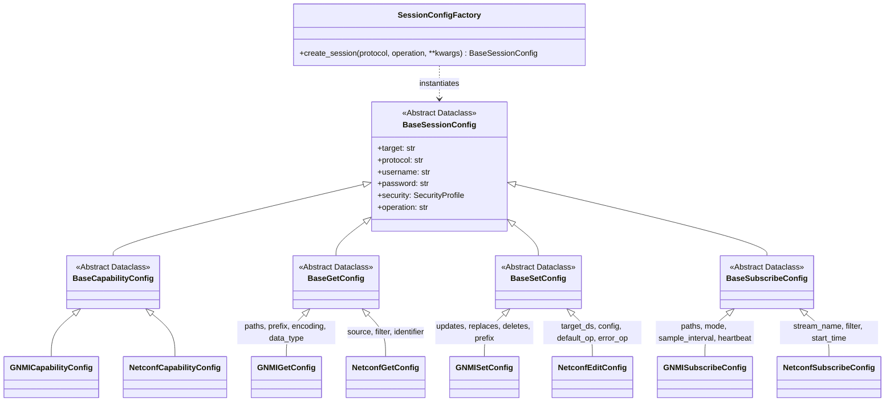

# **Antigravity AI Task: Per-RPC Session Configuration Hierarchy Refactor**

## **1\. System Identity & Mission Brief**

You are a Senior Network Automation Architect and Python Systems Engineer working on gnmi\_client\_py (branch managing\_session\_2).

### **Core Mission**

Refactor the configuration dataclass layer in `ui/cmd.py`. Transition the current monolithic session configuration classes (`GNMISessionConfig` and `NetconfSessionConfig`) into a strictly-typed, per-RPC configuration class hierarchy backed by abstract base classes and a centralized dispatch registry.

## **2\. Background & Architectural Justification**

### **2.1 The Current Problem ("Fat Object" Anti-pattern)**

Currently, `GNMISessionConfig` and `NetconfSessionConfig` in `ui/cmd.py` aggregate attributes for all disjoint operations into single classes:

* A capabilities request holds unused fields such as paths, updates, replaces, mode, sample\_interval, and filter.  
* A unary get request holds streaming parameters (mode, sample\_interval).  
* Streaming subscription requests hold unary mutation lists (updates, replaces).

This causes attribute pollution, obscures required parameters, weakens static type analysis (mypy, pyright), and leaks operational boundaries across workers.

### **2.2 Architectural Invariants & Guardrails**

1. **Python Dataclass Inheritance Trap:**  
   Subclasses in standard @dataclass raise a TypeError if a non-default field follows a parent field with a default value:  
    ```
    TypeError: non-default argument follows default argument
    ```
   **Requirement:** All dataclasses (both abstract bases and concrete classes) **must** use @dataclass(kw\_only=True) — requires Python3.10+.  
2. **Worker Parameter Propagation via \*\*kwargs:**  
   `UnaryManager` and `SubscriptionManager` unpack sessions using dataclasses.asdict(sc). The field names of the new concrete classes must match the parameter names expected by `specs/client.py`, and the workers (`UnaryWorker`, `SubscribeSession`).  
3. **Protocol Decoupling:**  
   Do not import grpc, ncclient, or worker classes inside `ui/cmd.py`.  
4. **Backward Compatibility:**  
   CLI subcommands (gnmi get, gnmi set, gnmi subscribe, netconf get-config, netconf edit-config, etc.) and multi-target YAML configuration parsing (`request_exp_named_sub_test.yaml`) must continue functioning with zero regressions.

## **3\. Target Class Architecture & Specifications**

### **3.1 Class Hierarchy Diagram**



### **3.2 Abstract Base Classes**
```py
from dataclasses import dataclass, field  
from typing import Optional  
from modules.security import SecurityProfile

@dataclass(kw_only=True)  
class BaseSessionConfig:  
    """Universal parameters common to any network session."""  
    target: str  
    protocol: str  
    username: str = ""  
    password: str = ""  
    security: SecurityProfile = field(default_factory=SecurityProfile)  
    operation: str = ""

@dataclass(kw_only=True)  
class BaseCapabilitiesConfig(BaseSessionConfig):  
    """Abstract base for capabilities / hello RPCs."""  
    pass

@dataclass(kw_only=True)  
class BaseGetConfig(BaseSessionConfig):  
    """Abstract base for retrieving operational state or configuration."""  
    pass

@dataclass(kw_only=True)  
class BaseSetConfig(BaseSessionConfig):  
    """Abstract base for mutating or editing configuration."""  
    pass

@dataclass(kw_only=True)  
class BaseSubscribeConfig(BaseSessionConfig):  
    """Abstract base for streaming telemetry or event notifications."""  
    pass
```

### **3.3 Concrete Protocol Dataclasses**

#### **gNMI Implementations**

```py
@dataclass(kw_only=True)  
class GNMICapabilitiesConfig(BaseCapabilitiesConfig):  
    protocol: str = "gnmi"  
    operation: str = "capabilities"

@dataclass(kw_only=True)  
class GNMIGetConfig(BaseGetConfig):  
    protocol: str = "gnmi"  
    operation: str = "get"  
    paths: list[str] = field(default_factory=list)  
    prefix: str = ""  
    encoding: str = "json_ietf"  
    data_type: str = "all"

@dataclass(kw_only=True)  
class GNMISetConfig(BaseSetConfig):  
    protocol: str = "gnmi"  
    operation: str = "set"  
    updates: list[tuple[str, str]] = field(default_factory=list)  
    replaces: list[tuple[str, str]] = field(default_factory=list)  
    deletes: list[str] = field(default_factory=list)  
    prefix: str = ""

@dataclass(kw_only=True)  
class GNMISubscribeConfig(BaseSubscribeConfig):  
    protocol: str = "gnmi"  
    operation: str = "subscribe"  
    paths: list[str] = field(default_factory=list)  
    prefix: str = ""  
    mode: str = "stream"            # stream, once, poll  
    stream_mode: str = "sample"     # sample, on_change, target_defined  
    sample_interval: int = 0  # seconds  
    heartbeat_interval: int = 0  
    suppress_redundant: bool = False  
    encoding: str = "json_ietf"  
    updates_only: bool = False
```

#### **NETCONF Implementations**

```py
@dataclass(kw_only=True)  
class NetconfCapabilitiesConfig(BaseCapabilitiesConfig):  
    protocol: str = "netconf"  
    operation: str = "capabilities"

@dataclass(kw_only=True)  
class NetconfGetConfig(BaseGetConfig):  
    protocol: str = "netconf"  
    operation: str = "get"  
    source: str = "running"  
    filter: Optional[str] = None  
    identifier: Optional[str] = None  
    version: Optional[str] = None  
    with_defaults: Optional[str] = None

@dataclass(kw_only=True)  
class NetconfEditConfig(BaseSetConfig):  
    protocol: str = "netconf"  
    operation: str = "edit-config"  
    target_datastore: str = "candidate"  
    config: Optional[str] = None  
    default_operation: str = "merge"  
    test_option: Optional[str] = None  
    error_option: str = "stop-on-error"

@dataclass(kw_only=True)  
class NetconfSubscribeConfig(BaseSubscribeConfig):  
    protocol: str = "netconf"  
    operation: str = "subscribe"  
    stream_name: str = "NETCONF"  
    filter: Optional[str] = None  
    start_time: Optional[str] = None  
    stop_time: Optional[str] = None
```

## **4\. Factory & Registration Dispatch Pattern**

Implement a centralized registry mapping (protocol, normalized\_operation) to the appropriate concrete class:

```py
SESSION_CONFIG_REGISTRY: dict[tuple[str, str], type[BaseSessionConfig]] = {  
    # gNMI mappings  
    ("gnmi", "capabilities"): GNMICapabilitiesConfig,  
    ("gnmi", "get"): GNMIGetConfig,  
    ("gnmi", "set"): GNMISetConfig,  
    ("gnmi", "subscribe"): GNMISubscribeConfig,  
    ("gnmi", "once"): GNMISubscribeConfig,  
    ("gnmi", "poll"): GNMISubscribeConfig,  
    ("gnmi", "stream"): GNMISubscribeConfig,

    # NETCONF mappings  
    ("netconf", "capabilities"): NetconfCapabilitiesConfig,  
    ("netconf", "get"): NetconfGetConfig,  
    ("netconf", "get-config"): NetconfGetConfig,  
    ("netconf", "get-schema"): NetconfGetConfig,  
    ("netconf", "edit-config"): NetconfEditConfig,  
    ("netconf", "set"): NetconfEditConfig,  
    ("netconf", "subscribe"): NetconfSubscribeConfig,  
}

def create_session_config(protocol: str, operation: str, **kwargs) -> BaseSessionConfig:  
    """Factory helper to safely instantiate specialized session configs."""  
    key = (protocol.lower(), operation.lower())  
    cls = SESSION_CONFIG_REGISTRY.get(key)  
    if not cls:  
        raise ValueError(f"No session config registered for protocol='{protocol}' and operation='{operation}'")  
&nbsp;&nbsp;&nbsp;&nbsp;  
    # Filter kwargs to only fields accepted by the target dataclass  
    valid_fields = {f.name for f in fields(cls)}  
    filtered_kwargs = {k: v for k, v in kwargs.items() if k in valid_fields}  
    return cls(**filtered_kwargs)
```

## **5\. Step-by-Step Implementation Instructions**

### **Step 1: Update ui/cmd.py Dataclass Definitions**

1. Import fields from dataclasses and ensure kw\_only=True is enabled on all dataclasses.  
2. Replace monolithic `GNMISessionConfig` and `NetconfSessionConfig` with the abstract bases and concrete classes defined in Section 3\.  
3. Keep backward-compatible type alias SessionConfig \= BaseSessionConfig to prevent breaking external type annotations.

### **Step 2: Implement Registry & Builder Updates**

1. Define `SESSION_CONFIG_REGISTRY` and create\_session\_config(...) in `ui/cmd.py`.  
2. Refactor CLIConfigBuilder:  
   * Inspect args.protocol and args.operation.  
   * Build SecurityProfile from args.  
   * Construct the concrete configuration dataclass using create\_session\_config.  
3. Refactor FileConfigBuilder:  
   * Extract protocol (default to 'gnmi' if unspecified) and operation (default to 'subscribe' for named subscriptions).  
   * Filter YAML parameters against the resolved dataclass fields and instantiate the specific class.

### **Step 3: Verify Manager Compatibility**

1. Inspect managers/manager.py (UnaryManager and SubscriptionManager).  
2. Verify that calling dataclasses.asdict(sc) continues to produce the expected keyword dictionaries for client.get(\*\*kwargs), client.set(\*\*kwargs), and client.subscribe(\*\*kwargs).  
3. Ensure no manager relies on hardcoded attributes that do not exist on the specialized class.

### **Step 4: Update Unit Tests**

1. Review tests/test\_managers.py and other test suites.  
2. Replace any manual instantiation of `GNMISessionConfig(...)` or generic `SessionConfig(...)` with the concrete class (e.g., `GNMIGetConfig`, `GNMISubscribeConfig`, or `NetconfGetConfig`).

## **6\. Verification Commands & Acceptance Criteria**

Execute the following commands to ensure complete backward compatibility:

\# 1\. Verify gNMI capabilities via CLI  
python client\_main.py \-\-target 10.1.11.101:9339 \-u admin \-p Frontier12# \-\-insecure gnmi capability

\# 2\. Verify gNMI Unary Get  
python client\_main.py \-\-target 10.1.11.101:9339 \-u admin \-p Frontier12# \-\-insecure gnmi get \-\-path "/interfaces/interface[name=\"TenGi0/1\"]"

\# 3\. Verify NETCONF Capabilities  
python client\_main.py \-\-target 10.1.11.101:9339 \-u admin \-p Frontier12# \-\-insecure netconf capability 

\# 4\. Verify NETCONF Get-Config  
python client\_main.py \-\-target 10.1.11.101:9339 \-u admin \-p Frontier12# \-\-insecure netconf get-config \--source running \--filter "/interfaces"

\# 5\. Verify YAML-based Multi-Target Subscriptions  
python client\_main.py gnmi \--config request\_exp\_named\_sub\_test.yaml

\# 6\. Execute Unit Tests  
pytest tests/

### **Acceptance Checklist**

* \[ \] No TypeError: non-default argument follows default argument on any dataclass import or instantiation.  
* \[ \] Monolithic attribute pollution eliminated; each RPC class holds only relevant fields.  
* \[ \] CLI parser produces the exact concrete dataclass matching (protocol, operation).  
* \[ \] YAML parser correctly resolves named subscriptions to GNMISubscribeConfig or NetconfSubscribeConfig.  
* \[ \] All existing pytest suites pass without errors.
